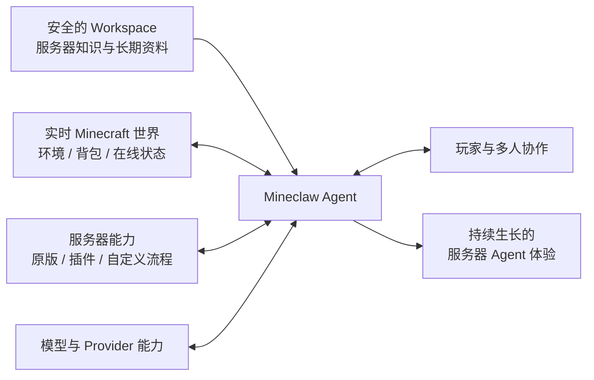

<div align="center">

# ⛏️ Mineclaw

**Give your Minecraft server an agent—not just a chatbot.**<br>
**给 Minecraft 服务器一个真正会理解、会查找、会规划、会行动的 Agent。**

Workspace-driven AI agents for Paper and Folia servers.<br>
面向 Paper 与 Folia 服务器、由工作区驱动的 AI Agent 体验。

<p>
  
  
  
  
  
  <a href="LICENSE"></a>
</p>

<p>
  <a href="https://github.com/kites262/mineclaw/releases/latest"><strong>下载</strong></a>
  · <a href="#五分钟启动"><strong>快速开始</strong></a>
  · <a href="docs/extensions.md"><strong>扩展能力</strong></a>
  · <a href="docs/security.md"><strong>安全模型</strong></a>
  · <a href="docs/operations.md"><strong>运维手册</strong></a>
</p>

</div>

---

Mineclaw 为 Minecraft 服务器带来一个常驻的 AI Agent。它了解这台服务器正在发生什么，也逐渐熟悉这里的规则、地图、活动、玩家习惯与插件生态；玩家用自然语言提出目标，它负责把知识、现场和能力组织成一次完整协作。

它像一位长期驻服的伙伴：知道资料放在哪里，需要时会查证，能把本服规则、现场状态和玩家意图放在一起。它可以回答问题，也可以规划路线、检查准备、协调玩家、使用服务器能力，并陪一项任务从想法走到结果。

安全的 Workspace 是它在服务器里的家。服主可以把世界设定、地图说明、活动档案、攻略、运行笔记与任何本服资料放进去；Mineclaw 会自主浏览、检索和选取文件，让自己的理解随服务器一起丰富。AGENTS 与 Skill 可以塑造它，但不会定义它的全部。

Mineclaw 同时连接实时世界、玩家与服务器生态。它能感知玩家此刻所处的环境和拥有的物品，也能把原版命令、第三方插件、Provider 能力和自定义工作流编排进同一个任务。随着服务器能力不断丰富，它也会成长为更完整的社区成员。

## 一位服务器 Agent 能带来什么

| 核心能力 | 带给服务器的变化 |
| --- | --- |
| 常驻的 Agent 身份 | 玩家拥有一个熟悉本服、能够持续协作的服务器角色 |
| 安全的 Workspace | 服务器拥有可持续积累的本地知识空间，Agent 会自主查找并运用其中的文件 |
| 对实时世界的感知 | 背包、装备、方块、位置和在线玩家成为理解任务的一部分 |
| 从目标到行动 | Agent 能拆解自然语言目标，补齐信息，规划步骤，并调用服务器能力推进任务 |
| 多玩家协作 | 选择、确认、角色分配和多人流程都可以留在游戏内自然完成 |
| 服务器生态编排 | 原版能力、第三方插件、Provider Tool 与自定义流程可以组合成更高层的玩法 |
| 连续的公共语境 | 对话、失败与任务进度能够延续，长会话会自动整理并保留关键上下文 |
| 可塑造的体验 | 服主可以定义身份、知识、能力、交互方式和服务器独有的办事风格 |

## 四种体验，看见 Agent 如何融入服务器

### 1. 服务器的知识真正活起来

服主把新赛季的世界设定、活动日程、路线图、奖励规则和历史记录放进安全的 Workspace。它们可以是 Skill，也可以只是普通 Markdown、说明文件或档案目录。Mineclaw 会自己寻找与当前问题有关的资料，把散落的本服信息组织成玩家此刻需要的答案。

于是玩家可以问：

> `@ai 我只有 25 分钟，穿着这套装备，从当前位置出发能完成哪条北境寻宝路线？还缺什么？`

Mineclaw 会同时理解活动规则、路线限制、开放时间、玩家位置和真实物资，排除不合适的方案，再给出一条属于这台服务器、这个玩家和这一刻的路线。Workspace 内容发生变化后，下一次任务自然会使用新的世界状态。

### 2. 对话可以继续走向行动

玩家可以请 Mineclaw 检查远征准备、定位结构、给予一项自助效果，或完成服主定义的其他操作。需要更多信息时，它继续问；需要玩家决定时，游戏里出现可点击的确认或选择；条件具备后，任务再向前推进。

发行包内置的自身药水效果就是一个完整示例：

> `@ai 给我 180 秒抗性提升 I。`

玩家会收到一张清晰的确认卡，接受后 Mineclaw 继续推进请求，并带着实际结果回到对话。服主可以沿用同一种体验，把签到奖励、任务领取、领地操作、经济交易或活动报名变成自然语言驱动的服务器流程。

### 3. 多人协作成为 Agent 的一项能力

当任务涉及多人，Mineclaw 可以同时理解发起者的目标和每位参与者的选择。比如：

> `@ai 组织 Alice、Bob 和 Carol 去北境遗迹。确认他们在线，让每个人从侦察、守卫、治疗里选一个不同角色；大家都同意后再建队并前往集合点。`

Mineclaw 可以联系每位玩家、收集角色、处理冲突、展示最终方案，再把大家带入下一阶段。有人改变主意、暂时离线或未能及时回应时，流程也会保留清晰状态。原本分散在聊天、命令和插件菜单里的协作，被组织成一段所有参与者都能理解的共同经历。

### 4. 现有插件生态拥有自然语言入口

Mineclaw 可以把第三方插件的能力纳入服务器 Agent，而不改变玩家表达目标的方式。仓库中的 [KitesPlaces 示例](examples/skills/kp-warps.md) 展示了命名传送点的接入：

> `@ai 从真实传送点里找出包含“农场”的候选，确认 Alice 和 Bob 在线；只有一个准确结果时，问问他们是否愿意前往。`

Mineclaw 会取得真实传送点、理解名称与用途、核对参与者，再把选择和行动串起来。同样的方式也可以连接领地、任务、经济、公会、小游戏和服主自己的插件。每接入一种能力，Agent 都会多一种理解服务器、帮助玩家完成目标的方式。

## Mineclaw 如何融入服务器



Mineclaw 位于玩家、世界、服务器知识和插件生态的交汇处。安全的 Workspace 让它拥有本地、可持续积累的理解；实时环境和服务器能力让这种理解能够落到正在发生的游戏里。具体 Tool Schema、Function API、命令边界与目录隔离留在[扩展指南](docs/extensions.md)和[安全模型](docs/security.md)中说明。

## 五分钟启动

运行目标：**Paper 26.2 或 Folia 26.2 + Java 25**。其他服务端、Minecraft 或 Java 版本不在当前兼容承诺内。

1. 从 [GitHub Releases](https://github.com/kites262/mineclaw/releases/latest) 下载 `Mineclaw-1.0.0.jar`，放入服务端 `plugins/`。
2. 启动一次，让 Mineclaw 生成默认文件，然后停止服务端。
3. 在 `plugins/Mineclaw/.env` 写入密钥：

   ```dotenv
   MINECLAW_API_KEY=replace-with-your-secret
   ```

4. 按需修改 `providers.yml`。发行配置使用 OpenAI-compatible Chat Completions，并通过标准 `Authorization: Bearer <key>` 请求头发送凭据。
5. 启动服务端，在公屏输入：

   ```text
   @ai 看看我脚下是什么，并告诉我背包还缺哪些远征补给
   ```

首次启动目录：

```text
plugins/Mineclaw/
├── config.yml             # 运行限制与游戏内行为
├── providers.yml          # Provider、模型、原生 Tool 与请求扩展
├── whitelist.yml          # 模型直接 run_command 的策略
├── .env                   # 凭据，不进入 JAR/Workspace
├── message.yml            # 玩家文案与交互布局
├── tools.yml              # 9 个内置 Tool 的 Schema 2 目录
├── functions.yml          # 自定义 JavaScript 工作流
└── workspace/
    ├── AGENTS.md           # Agent 身份、工作方法与安全约束
    └── skills/
        ├── locate-structure.md
        └── self-potion-effect.md
```

默认 Provider 示例包含 128K 上下文、16K 最大输出、100K 自动压缩界限、`reasoning_content` 交错回传、Session 级 `prompt_cache_key`，以及 MiMo 原生 `web_search`。所有字段和生命周期见[配置参考](docs/configuration.md)。

> **从 v0.x 升级：** v1.0.0 是不兼容的大版本，不读取旧 Schema，也没有兼容转换层。先备份旧目录，用 v1 生成全新文件，再按[迁移说明](docs/operations.md#从-v0x-迁移)人工迁移意图；不要把旧配置整份覆盖回来。

## 让 Agent 随服务器一起成长

| 可以塑造的部分 | Mineclaw 如何生长 |
| --- | --- |
| 身份与氛围 | 用 AGENTS 和消息主题定义它是谁、怎样说话、如何融入社区 |
| 本服知识 | 在安全的 Workspace 中持续加入世界设定、档案、攻略、活动和运行资料 |
| 世界感知 | 让 Agent 理解更多与玩家、环境和服务器状态有关的实时信息 |
| 服务器能力 | 把原版操作、第三方插件和自定义流程组合成面向目标的能力 |
| 玩家协作 | 设计确认、选择、角色分配、报名和多人任务等游戏内体验 |
| 模型与外部能力 | 按服务器需要选择模型，并接入 Provider 提供的原生能力 |

这些部分既可以从内置示例开始，也可以随着服务器玩法逐步扩展。想了解文件分工、Tool Schema、Function API 和具体配置方式，请继续阅读[配置参考](docs/configuration.md)与[扩展指南](docs/extensions.md)。

## 安全与运行边界

Mineclaw 能够接触真实游戏状态并推动服务器任务，因此 Workspace、配置、玩家交互和执行能力之间有清晰边界。服主可以决定 Agent 看见什么、能使用什么、何时需要玩家参与，以及一项能力如何进入服务器。完整的隔离策略、命令路径、JavaScript 运行环境和结果语义见[安全模型](docs/security.md)。

## 长对话也有自己的整理节奏

公共会话让玩家和 Mineclaw 共享一段连续经历：前面的计划、遇到的失败和已经完成的步骤，会成为后续协作的背景。对话逐渐变长时，Mineclaw 会整理较早的历史，同时保留近期内容和仍然重要的任务证据。

默认模型配置提供 128K 上下文、16K 最大输出和 100K 自动整理界限；管理员也可以随时使用 `/mineclaw compact` 主动整理。具体 token 计算、排队和失败恢复行为见[配置参考](docs/configuration.md#模型限制与自动压缩)。

## 管理命令

| 命令 | 作用 | 默认权限 |
| --- | --- | --- |
| `/mineclaw clear` | 清空公共 Session，并轮换 prompt cache key | OP |
| `/mineclaw compact` | 立即压缩，或排在活动 Turn 后 | OP |
| `/mineclaw reload` | 原子重载四个控制面文件 | OP |
| `/mineclaw model [list\|default\|provider/model]` | 查看或切换后续 Turn 使用的模型 | OP |
| `/mineclaw tools [validate]` | 查看/校验本地 Tool 目录，不执行 Tool | OP |
| `/mineclaw functions [validate]` | 查看/校验 Function 与 Skill 引用，不执行 Function | OP |

普通聊天权限 `mineclaw.command.chat` 默认开放；完整权限表与热更新范围见[运维手册](docs/operations.md)。

## 文档

- [配置参考](docs/configuration.md) — 所有文件、Schema、默认值、Provider 与重载生命周期
- [扩展指南](docs/extensions.md) — AGENTS、Skill、Tool、Function、Bundled API 与复杂编排
- [安全模型](docs/security.md) — 信任边界、命令路径、沙箱、Workspace 与结果证据
- [运维手册](docs/operations.md) — 安装、v0.x 迁移、命令、诊断、构建和发布检查
- [更新记录](CHANGELOG.md) — v1.0.0 的破坏性变化与新增能力

## 从源码构建

```bash
git clone https://github.com/kites262/mineclaw.git
cd mineclaw
git checkout 1.0.0
./gradlew --no-daemon clean test assemblePlugin
```

产物位于 `build/plugins/Mineclaw-1.0.0.jar`。JAR 使用可复现的文件顺序和时间戳设置，并包含 Apache-2.0、NOTICE 与第三方许可证资源。

## 兼容性

v1.0.0 当前面向 Paper/Folia 26.2、Java 25 与 OpenAI-compatible Chat Completions。其他运行约定、诊断方式与升级边界见[运维手册](docs/operations.md)。

## License

[Apache License 2.0](LICENSE) © Mineclaw contributors。第三方声明见 [NOTICE](NOTICE)。
