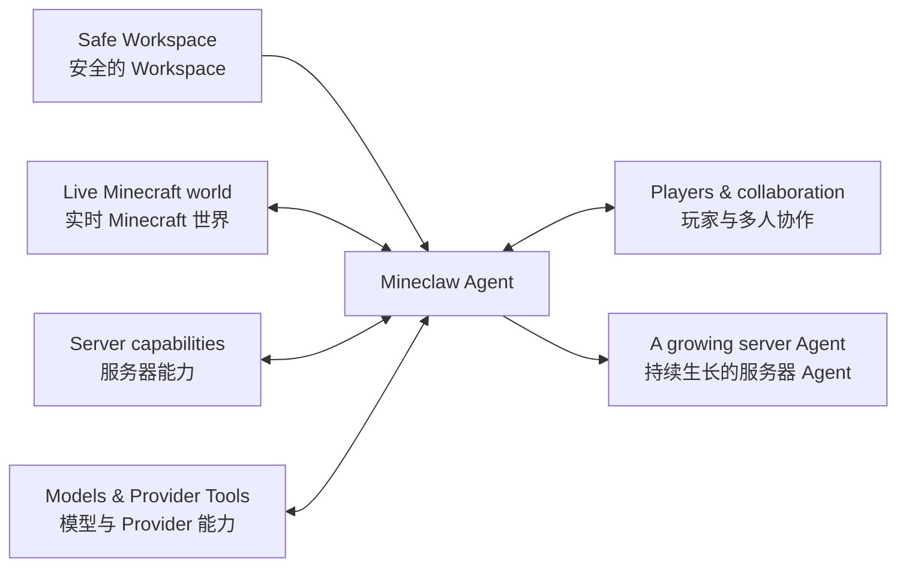

<div align="center">

# ⛏️ Mineclaw

**Give your Minecraft an agent—not just a chatbot.**<br>
**给 Minecraft 一个有意识、会行动的 Agent。**

Workspace-driven AI agents for Paper and Folia servers.<br>
面向 Paper 与 Folia 服务器、由工作区驱动的 AI Agent 体验。

<p>
  <a href="https://github.com/kites262/mineclaw/releases/tag/1.3.0"></a>
  
  
  
  
  <a href="LICENSE"></a>
</p>

<p>
  <a href="https://github.com/kites262/mineclaw/releases/latest"><strong>Download / 下载</strong></a>
  · <a href="#quick-start"><strong>Quick Start / 快速开始</strong></a>
  · <a href="docs/extensions.md"><strong>Extensions / 扩展</strong></a>
  · <a href="docs/security.md"><strong>Security / 安全</strong></a>
  · <a href="docs/operations.md"><strong>Operations / 运维</strong></a>
</p>

<p>
  <strong>🧠 Server knowledge / 本服知识</strong>
  · <strong>🌍 Live context / 现场感知</strong>
  · <strong>🧭 Goal planning / 目标规划</strong><br>
  <strong>⚙️ Server actions / 能力调用</strong>
  · <strong>🤝 Player collaboration / 玩家协作</strong>
</p>

</div>

---

**Mineclaw brings a resident AI Agent to your Minecraft server.** It understands what is happening now and gradually becomes familiar with the server's rules, maps, events, player habits, and plugin ecosystem. Players describe a goal in natural language; Mineclaw brings knowledge, live context, and available capabilities together into one coherent collaboration.<br>
**Mineclaw 为 Minecraft 服务器带来一个常驻的 AI Agent。** 它了解这台服务器正在发生什么，也逐渐熟悉这里的规则、地图、活动、玩家习惯与插件生态；玩家用自然语言提出目标，它负责把知识、现场和能力组织成一次完整协作。

It feels like a long-term companion on the server: it knows where information lives, verifies facts when needed, and considers server rules, current conditions, and player intent together. It asks when something is unclear, waits for players when a decision belongs to them, and continues with the task once the path is ready.<br>
它像一位长期驻服的伙伴：知道资料放在哪里，需要时会查证，能把本服规则、现场状态和玩家意图放在一起。该询问时询问，该等待玩家决定时等待，条件具备以后再继续推进任务。

**A safe Workspace is its home on the server.** Operators can place world lore, map notes, event archives, guides, operating notes, and any server-specific material inside it. Mineclaw can autonomously browse, search, select, create, and maintain files there, allowing its understanding to grow with the server. AGENTS and Skills can shape the Agent, but they do not define the limits of what it can know or organize.<br>
**安全的 Workspace 是它在服务器里的家。** 服主可以把世界设定、地图说明、活动档案、攻略、运行笔记与任何本服资料放进去；Mineclaw 能自主浏览、检索、选取、创建和管理其中的文件，让自己的理解随服务器一起丰富。AGENTS 与 Skill 可以塑造它，但不会定义它所能理解和组织的一切。

**The world, its players, and the server ecosystem all become part of the same task.** Mineclaw can perceive a player's environment and inventory, then compose vanilla commands, third-party plugins, Provider capabilities, and custom workflows around the goal at hand. As the server gains new knowledge and capabilities, the Agent grows into a more complete member of the community.<br>
**世界、玩家与服务器生态都在同一段协作里。** Mineclaw 能感知玩家此刻所处的环境和拥有的物品，也能围绕当前目标编排原版命令、第三方插件、Provider 能力和自定义工作流。随着服务器的知识与能力不断丰富，它也会成长为更完整的社区成员。

## ✨ What a server Agent brings

**一位服务器 Agent 能带来什么**

- **🧠 A resident identity.** Players gain a server companion that knows this community and can stay involved across an ongoing task.<br>
  **常驻的 Agent 身份。** 玩家拥有一个熟悉本服、能够持续参与任务的服务器伙伴。

- **🗂️ A safe Workspace.** Server knowledge can accumulate locally in ordinary files that the Agent autonomously discovers, reads, and maintains—not only in predefined Skills or Tools.<br>
  **安全的 Workspace。** 本服知识可以持续积累在普通文件中，由 Agent 自主发现、读取和管理，而不只存在于预定义的 Skill 或 Tool 里。

- **👁️ Awareness of the live world.** Structured player snapshots, item details, block state, and online players become part of how a request is understood.<br>
  **对实时世界的感知。** 结构化玩家快照、物品详情、方块状态与在线玩家都会成为理解请求的一部分。

- **🧭 A path from goals to action.** The Agent can break down a natural-language goal, gather missing facts, plan the steps, and use server capabilities to move the task forward.<br>
  **从目标到行动。** Agent 能拆解自然语言目标、补齐事实、规划步骤，并调用服务器能力推进任务。

- **🤝 Multiplayer collaboration.** Confirmation, selection, role assignment, and multi-participant flows can happen naturally inside the game.<br>
  **多玩家协作。** 确认、选择、角色分配和多人流程都可以自然地留在游戏内完成。

- **🧩 Composition across the server ecosystem.** Vanilla mechanics, third-party plugins, Provider Tools, and custom workflows can become higher-level gameplay capabilities.<br>
  **服务器生态编排。** 原版能力、第三方插件、Provider Tool 与自定义流程可以组合成更高层的玩法。

- **🧵 A continuous public context.** Plans, failures, and progress can carry into later turns, while long conversations are compacted without discarding the evidence that still matters.<br>
  **连续的公共语境。** 计划、失败与任务进度能够延续；长会话会自动整理，同时保留仍然重要的证据。

- **🎨 An experience operators can shape.** Identity, knowledge, abilities, interactions, and the server's own style of getting things done can all evolve together.<br>
  **可塑造的体验。** 服主可以共同塑造身份、知识、能力、交互方式，以及这台服务器独有的办事风格。

## 🧭 Four ways the Agent becomes part of the server

**四种体验，看见 Agent 如何融入服务器**

### 📚 1. Make server knowledge come alive

**让服务器的知识真正活起来**

An operator places the new season's lore, event schedule, route maps, reward rules, and historical records in the safe Workspace. They can be Skills, ordinary Markdown files, notes, or entire archive directories. Mineclaw finds the material relevant to the current question and turns scattered server knowledge into an answer for this player, at this moment.<br>
服主把新赛季的世界设定、活动日程、路线图、奖励规则和历史记录放进安全的 Workspace。它们可以是 Skill，也可以只是普通 Markdown、说明文件或完整的档案目录。Mineclaw 会自己寻找与当前问题有关的资料，把散落的本服信息组织成这个玩家此刻需要的答案。

> **Player / 玩家**
>
> `@ai I only have 25 minutes. With this equipment and my current location, which northern treasure route can I finish, and what am I missing?`
>
> `@ai 我只有 25 分钟，穿着这套装备，从当前位置出发能完成哪条北境寻宝路线？还缺什么？`

The Agent considers event rules, route restrictions, opening times, the player's position, and actual supplies together. It rejects unsuitable routes and produces a plan grounded in this server, this player, and this moment. When Workspace files change, the next task naturally uses the new world state.<br>
Agent 会同时理解活动规则、路线限制、开放时间、玩家位置和真实物资，排除不合适的方案，再给出一条属于这台服务器、这个玩家和这一刻的路线。Workspace 内容发生变化后，下一次任务自然会使用新的世界状态。

### ⚙️ 2. Let conversation continue into action

**让对话继续走向行动**

Players can ask Mineclaw to check expedition readiness, locate a structure, grant a self-service effect, or perform another server-defined operation. It asks for missing information, presents an in-game confirmation or selection when a player must decide, and resumes the workflow once the conditions are satisfied.<br>
玩家可以请 Mineclaw 检查远征准备、定位结构、给予一项自助效果，或完成服主定义的其他操作。需要更多信息时，它继续问；需要玩家决定时，游戏里出现确认或选择；条件具备后，流程再向前推进。

> **Player / 玩家**
>
> `@ai Give me Resistance I for 180 seconds.`
>
> `@ai 给我 180 秒抗性提升 I。`

The bundled self-potion effect is a complete example: the player receives a clear confirmation card, and Mineclaw continues after acceptance with the real result attached to the conversation. Operators can build the same kind of experience for daily rewards, quest claims, land management, economy transactions, or event registration.<br>
发行包内置的自身药水效果就是一个完整示例：玩家会收到清晰的确认卡，接受后 Mineclaw 继续推进，并带着实际结果回到对话。服主可以沿用同一种体验，把签到奖励、任务领取、领地操作、经济交易或活动报名变成自然语言驱动的服务器流程。

### 🤝 3. Make multiplayer coordination an Agent capability

**让多人协作成为 Agent 的一项能力**

When a task involves several players, Mineclaw can keep the requester's goal and every participant's choice in the same workflow.<br>
当任务涉及多人，Mineclaw 可以把发起者的目标与每位参与者的选择放在同一个流程中理解。

> **Player / 玩家**
>
> `@ai Organize Alice, Bob, and Carol for the northern ruins. Make sure they are online, assign a unique scout, guard, and healer, then form the party after everyone agrees.`
>
> `@ai 组织 Alice、Bob 和 Carol 去北境遗迹。确认他们在线，让每个人从侦察、守卫、治疗里选一个不同角色；大家都同意后再建队。`

Mineclaw can contact each player, collect roles, resolve conflicts, present the final plan, and move the group into the next stage. If someone changes their mind, goes offline, or does not respond in time, the workflow still retains a clear state. Decisions once scattered across chat, commands, and plugin menus become one shared experience everyone can understand.<br>
Mineclaw 可以联系每位玩家、收集角色、处理冲突、展示最终方案，再把队伍带入下一阶段。有人改变主意、暂时离线或未能及时回应时，流程仍然保留清晰状态。原本分散在聊天、命令和插件菜单里的协作，被组织成一段所有参与者都能理解的共同经历。

### 🔌 4. Give the existing plugin ecosystem a natural-language entrance

**让现有插件生态拥有自然语言入口**

Mineclaw can bring third-party plugin capabilities into the server Agent without changing how players express their goals. The repository's [KitesPlaces example](examples/skills/kp-warps.md) demonstrates how named warps can become part of a larger task.<br>
Mineclaw 可以把第三方插件能力纳入服务器 Agent，而不改变玩家表达目标的方式。仓库中的 [KitesPlaces 示例](examples/skills/kp-warps.md) 展示了命名传送点如何成为更大任务的一部分。

> **Player / 玩家**
>
> `@ai Find real warps containing “farm”, make sure Alice and Bob are online, and ask whether they want to go if there is one exact result.`
>
> `@ai 从真实传送点里找出包含“农场”的候选，确认 Alice 和 Bob 在线；只有一个准确结果时，问问他们是否愿意前往。`

Mineclaw obtains the real warp list, understands names and purposes, checks the participants, and connects choice with action. The same pattern can extend to land, quests, economies, guilds, minigames, and operator-authored plugins. Every integrated capability gives the Agent another way to understand the server and help players finish what they intended.<br>
Mineclaw 会取得真实传送点、理解名称与用途、核对参与者，再把选择和行动串起来。同样的方式也可以连接领地、任务、经济、公会、小游戏和服主自己的插件。每接入一种能力，Agent 都会多一种理解服务器、帮助玩家完成目标的方式。

## 🧩 How Mineclaw fits into a server

**Mineclaw 如何融入服务器**



Mineclaw lives where players, the world, server knowledge, and the plugin ecosystem meet. The safe Workspace provides local, durable understanding; live context and server capabilities let that understanding matter inside the game. Tool Schema, Function APIs, command boundaries, and directory isolation are documented separately in the [extension guide](docs/extensions.md) and [security model](docs/security.md).<br>
Mineclaw 位于玩家、世界、服务器知识和插件生态的交汇处。安全的 Workspace 让它拥有本地、可持续积累的理解；实时环境和服务器能力让这种理解能够落到正在发生的游戏里。具体 Tool Schema、Function API、命令边界与目录隔离留在[扩展指南](docs/extensions.md)和[安全模型](docs/security.md)中说明。

> **Knowledge gives it context. The world gives it facts. Capabilities let it act. Players make it part of the community.**<br>
> **知识给它背景，世界给它事实，能力让它行动，玩家让它成为社区的一部分。**

<a id="quick-start"></a>
<a id="五分钟启动"></a>

## 🚀 Quick start

**五分钟启动**

> [!NOTE]
> **Runtime target:** Paper 26.2 or Folia 26.2 with Java 25. Other server, Minecraft, and Java versions are outside the current compatibility promise.<br>
> **运行目标：** Paper 26.2 或 Folia 26.2 + Java 25。其他服务端、Minecraft 或 Java 版本不在当前兼容承诺内。

1. Download `Mineclaw-1.3.0.jar` from [GitHub Releases](https://github.com/kites262/mineclaw/releases/latest) and place it in the server's `plugins/` directory.<br>
   从 [GitHub Releases](https://github.com/kites262/mineclaw/releases/latest) 下载 `Mineclaw-1.3.0.jar`，放入服务端 `plugins/`。

2. Start the server once so Mineclaw can generate its default files, then stop it.<br>
   启动一次，让 Mineclaw 生成默认文件，然后停止服务端。

3. Put the API key in `plugins/Mineclaw/.env`.<br>
   在 `plugins/Mineclaw/.env` 写入密钥。

   ```dotenv
   MINECLAW_API_KEY=replace-with-your-secret
   ```

4. Adjust `providers.yml` as needed. The bundled configuration uses OpenAI-compatible Chat Completions and sends credentials through the standard `Authorization: Bearer <key>` header.<br>
   按需修改 `providers.yml`。发行配置使用 OpenAI-compatible Chat Completions，并通过标准 `Authorization: Bearer <key>` 请求头发送凭据。

5. Start the server and speak to Mineclaw in public chat.<br>
   启动服务端，在公屏与 Mineclaw 对话。

   ```text
   @ai Look at the block under my feet and tell me what expedition supplies are missing from my inventory.
   @ai 看看我脚下是什么，并告诉我背包还缺哪些远征补给。
   ```

First-start directory:<br>
首次启动目录：

```text
plugins/Mineclaw/
├── config.yml             # Runtime limits and game behavior / 运行限制与游戏行为
├── providers.yml          # Providers, models, native Tools / Provider、模型与原生 Tool
├── whitelist.yml          # Direct model command policy / 模型直接命令策略
├── .env                   # Credentials outside the Workspace / Workspace 外的凭据
├── message.yml            # Player messages and layouts / 玩家文案与交互布局
├── tools.yml              # Built-in Tool catalog / 内置 Tool 目录
├── functions.yml          # JavaScript workflows / JavaScript 工作流
└── workspace/
    ├── AGENTS.md           # Agent identity and operating style / Agent 身份与工作方式
    └── skills/
        ├── locate-structure.md
        └── self-potion-effect.md
```

The default Provider example includes a 128K context window, 16K maximum output, a 100K automatic compaction threshold, interleaved `reasoning_content` replay, a Session-level `prompt_cache_key`, and MiMo native `web_search`. See the [configuration reference](docs/configuration.md) for every field and lifecycle.<br>
默认 Provider 示例包含 128K 上下文、16K 最大输出、100K 自动压缩界限、`reasoning_content` 交错回传、Session 级 `prompt_cache_key`，以及 MiMo 原生 `web_search`。所有字段和生命周期见[配置参考](docs/configuration.md)。

> [!IMPORTANT]
> **Upgrading from v0.x:** v1.0.0 is an incompatible major release. It does not read old schemas and has no compatibility conversion layer. Back up the old directory, let v1 generate new files, then migrate the configuration intent according to the [migration guide](docs/operations.md#从-v0x-迁移). Do not copy the old configuration over the new one.<br>
> **从 v0.x 升级：** v1.0.0 是不兼容的大版本，不读取旧 Schema，也没有兼容转换层。先备份旧目录，用 v1 生成全新文件，再按[迁移说明](docs/operations.md#从-v0x-迁移)迁移配置意图；不要把旧配置整份覆盖回来。

> [!IMPORTANT]
> **Upgrading from v1.1.x:** v1.2.0 replaces `look_block`, `feet_block`, and `inventory` with `block_inspect` and `item_inspect`; there are no compatibility aliases. Update `tools.yml`, Function capabilities, Workspace Skills, and the renamed environment configuration before starting the new JAR. See the [operations guide](docs/operations.md#从-v11x-升级).<br>
> **从 v1.1.x 升级：** v1.2.0 用 `block_inspect` 和 `item_inspect` 替换 `look_block`、`feet_block` 与 `inventory`，不提供兼容别名。启动新 JAR 前必须更新 `tools.yml`、Function capability、Workspace Skill 和已改名的环境配置；步骤见[运维手册](docs/operations.md#从-v11x-升级)。

## 🌱 Let the Agent grow with the server

**让 Agent 随服务器一起成长**

- **🎭 Identity and atmosphere.** Use AGENTS and message themes to shape who it is, how it speaks, and how it belongs in the community.<br>
  **身份与氛围。** 用 AGENTS 和消息主题塑造它是谁、怎样说话、如何融入社区。

- **📚 Server knowledge.** Keep adding world lore, archives, guides, events, and operating material to the safe Workspace.<br>
  **本服知识。** 在安全的 Workspace 中持续加入世界设定、档案、攻略、活动和运行资料。

- **🌍 World awareness.** Give the Agent more ways to understand players, their environment, and live server state.<br>
  **世界感知。** 让 Agent 理解更多与玩家、环境和服务器状态有关的实时信息。

- **⚙️ Server capabilities.** Compose vanilla operations, third-party plugins, and custom workflows into goal-oriented abilities.<br>
  **服务器能力。** 把原版操作、第三方插件和自定义流程组合成面向目标的能力。

- **🤝 Player collaboration.** Design confirmation, selection, role assignment, registration, and multiplayer task experiences.<br>
  **玩家协作。** 设计确认、选择、角色分配、报名和多人任务等游戏内体验。

- **✨ Models and external capabilities.** Choose the right models for the server and connect native capabilities supplied by Providers.<br>
  **模型与外部能力。** 按服务器需要选择模型，并接入 Provider 提供的原生能力。

These parts can begin with the bundled examples and expand as the server evolves. Continue with the [configuration reference](docs/configuration.md) and [extension guide](docs/extensions.md) for file roles, Tool Schema, Function APIs, and concrete examples.<br>
这些部分既可以从内置示例开始，也可以随着服务器玩法逐步扩展。文件分工、Tool Schema、Function API 与具体案例见[配置参考](docs/configuration.md)和[扩展指南](docs/extensions.md)。

## 🛡️ Security and operating boundaries

**安全与运行边界**

Mineclaw can observe real game state and move server tasks forward, so the Workspace, configuration, player interactions, and execution capabilities have explicit boundaries. Operators decide what the Agent can see, what it can use, when a player participates in a decision, and how a new capability enters the server.<br>
Mineclaw 能够接触真实游戏状态并推动服务器任务，因此 Workspace、配置、玩家交互和执行能力之间有清晰边界。服主可以决定 Agent 看见什么、能使用什么、玩家何时参与决定，以及一项新能力如何进入服务器。

- **Safe Workspace isolation.** The model's file root is fixed at `plugins/Mineclaw/workspace`; configuration and credentials live outside that tree.<br>
  **安全 Workspace 隔离。** 模型文件根固定为 `plugins/Mineclaw/workspace`；配置与凭据位于这棵文件树之外。

- **Different paths carry different trust.** Direct model commands follow server policy, while reviewed JavaScript Functions execute only their declared capabilities.<br>
  **不同路径承载不同信任。** 模型直接命令遵循服务器策略；经过服主审核的 JavaScript Function 只执行它明确声明的能力。

- **Player decisions stay with players.** Confirmation and selection can be delivered as native, configurable in-game interactions.<br>
  **玩家决定留给玩家。** 确认与选择可以通过原生且可配置的游戏内交互完成。

- **Completed results keep their full evidence.** Tool, Function, approval, and dispatch frames remain available to later reasoning; failed response attempts are retried and never published as synthetic history.<br>
  **已完成结果保留完整证据。** Tool、Function、审批与分发帧会继续提供给后续推理；失败的响应尝试会重试，不会作为合成历史写入 Session。

Read the complete trust model, command paths, JavaScript runtime, and result semantics in the [security documentation](docs/security.md).<br>
完整的信任模型、命令路径、JavaScript 运行环境与结果语义见[安全文档](docs/security.md)。

## 🧠 Long conversations have a rhythm of their own

**长对话也有自己的整理节奏**

A public Session gives players and Mineclaw a shared history. Every completed Turn is archived losslessly with player attribution, Tool Calls, Tool Results, Provider replay fields, and the untruncated final answer. As the conversation grows, Mineclaw may compact the model-context projection while leaving that raw Session archive intact.<br>
公共 Session 让玩家与 Mineclaw 共享一段连续经历。每个已完成 Turn 都会连同玩家归属、Tool Call、Tool Result、Provider 回放字段和未截断最终回复无损归档。对话变长时，Mineclaw 可以整理送给模型的上下文投影，但不会删除 Session 原始档案。

The default model configuration provides a 128K context window, 16K maximum output, and a 100K automatic compaction threshold. Administrators can also run `/mineclaw compact` at any time. Token accounting, queuing, and overflow recovery are covered in the [configuration reference](docs/configuration.md#模型限制与自动压缩).<br>
默认模型配置提供 128K 上下文、16K 最大输出和 100K 自动整理界限；管理员也可以随时使用 `/mineclaw compact` 主动整理。Token 计算、排队和溢出恢复见[配置参考](docs/configuration.md#模型限制与自动压缩)。

## 🎛️ Administrative commands

**管理命令**

- **`/mineclaw listen [on|off]`** — Inspect or change the process-local server-wide listen mode.<br>
  查看或切换服务器连续监听；开启后，符合现有权限与限流条件的普通公屏消息无需前缀也能唤醒 Mineclaw，成功接收后会显示 AI 前缀；插件禁用或服务器重启后重置。Default permission / 默认权限：OP。

- **`/mineclaw clear`** — Clear the public Session and rotate its prompt cache key.<br>
  清空公共 Session，并轮换 prompt cache key。Default permission / 默认权限：OP。

- **`/mineclaw compact`** — Compact now, or queue compaction behind the active Turn.<br>
  立即压缩，或排在活动 Turn 后执行。Default permission / 默认权限：OP。

- **`/mineclaw reload`** — Atomically reload the four control-plane files.<br>
  原子重载四个控制面文件。Default permission / 默认权限：OP。

- **`/mineclaw model [list|default|provider/model]`** — Inspect or change the model used by future Turns.<br>
  查看或切换后续 Turn 使用的模型。Default permission / 默认权限：OP。

- **`/mineclaw tools [validate]`** — Inspect or validate the local Tool catalog without executing a Tool.<br>
  查看或校验本地 Tool 目录，不执行 Tool。Default permission / 默认权限：OP。

- **`/mineclaw functions [validate]`** — Inspect or validate Functions and Skill references without executing a Function.<br>
  查看或校验 Function 与 Skill 引用，不执行 Function。Default permission / 默认权限：OP。

Public chat access uses `mineclaw.command.chat` and is enabled by default. See the [operations guide](docs/operations.md) for the full permission list and reload lifecycle.<br>
普通聊天权限 `mineclaw.command.chat` 默认开放；完整权限表与热更新范围见[运维手册](docs/operations.md)。

## 📖 Documentation

**文档**

- ⚙️ [Configuration reference](docs/configuration.md) — Every file, schema, default, Provider, and reload lifecycle.<br>
  [配置参考](docs/configuration.md) — 所有文件、Schema、默认值、Provider 与重载生命周期。

- 🧩 [Extension guide](docs/extensions.md) — AGENTS, Skills, Tools, Functions, bundled APIs, and complex orchestration.<br>
  [扩展指南](docs/extensions.md) — AGENTS、Skill、Tool、Function、Bundled API 与复杂编排。

- 🛡️ [Security model](docs/security.md) — Trust boundaries, command paths, sandboxing, Workspace, and result evidence.<br>
  [安全模型](docs/security.md) — 信任边界、命令路径、沙箱、Workspace 与结果证据。

- 🧰 [Operations guide](docs/operations.md) — Installation, v0.x migration, commands, diagnostics, builds, and release checks.<br>
  [运维手册](docs/operations.md) — 安装、v0.x 迁移、命令、诊断、构建和发布检查。

- 📝 [Changelog](CHANGELOG.md) — Release history, breaking changes, and new capabilities.<br>
  [更新记录](CHANGELOG.md) — 版本历史、破坏性变化与新增能力。

## 🛠️ Build from source

**从源码构建**

```bash
git clone https://github.com/kites262/mineclaw.git
cd mineclaw
git checkout 1.3.0
./gradlew --no-daemon clean test assemblePlugin
```

The deployable artifact is `build/plugins/Mineclaw-1.3.0.jar`. The JAR uses reproducible file ordering and timestamps and includes Apache-2.0, NOTICE, and third-party license resources.<br>
可部署产物位于 `build/plugins/Mineclaw-1.3.0.jar`。JAR 使用可复现的文件顺序和时间戳设置，并包含 Apache-2.0、NOTICE 与第三方许可证资源。

## ✅ Compatibility

**兼容性**

- **Server:** Paper 26.2 or Folia 26.2; the descriptor declares native Folia support.<br>
  **服务端：** Paper 26.2 或 Folia 26.2；插件描述声明原生支持 Folia。

- **Runtime:** Java 25.<br>
  **运行时：** Java 25。

- **Model API:** OpenAI-compatible Chat Completions.<br>
  **模型接口：** OpenAI-compatible Chat Completions。

- **Other platforms:** Other server, Paper, Minecraft, and Java versions are not part of the current compatibility promise.<br>
  **其他平台：** 其他服务端、Paper、Minecraft 与 Java 版本不在当前兼容承诺内。

Treat **26.2 + Java 25** as the current target, not a minimum-version declaration.<br>
请把 **26.2 + Java 25** 视为当前适配目标，而不是最低版本。

## 📄 License

**许可证**

[Apache License 2.0](LICENSE) © Mineclaw contributors. Third-party notices are available in [NOTICE](NOTICE).<br>
[Apache License 2.0](LICENSE) © Mineclaw contributors。第三方声明见 [NOTICE](NOTICE)。
